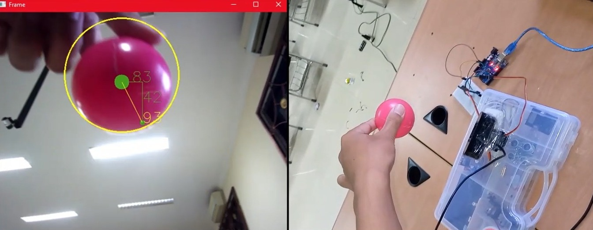

# Camera-Auto-Track-use-Arduino-and-PID-Controller
Tracking an object by servos, opencv implemented to PID controller with a distance bewteen center and frame and current object position as input

## some higlight
```
ser = serial.Serial('COM9', 9600)  # Change the COM port to the one you use for Arduino
```

Software include:
- Python
- OpenCV
- simple_pid

Hardware include:
- Camera HK-Vision
- Computer
- Arduino Uno
- Servo
- Pan-tilt servo [tokopedia](https://www.tokopedia.com/hiperplay/servo-bracket-arduino-pan-tilt-camera-1731399739901051994)
***

[see video](https://youtu.be/QnJYj1_6FVE)


